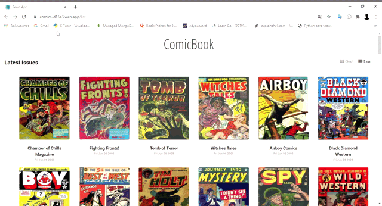

## COOMIC REACT APP

Comic react app its a web that feed with the API of comic vine and display a list of the newer comics in the platform and if you click of one of then show his details.



## Requirements

### `Heroku` 

first of all you have to do a little deployment in heroku to solve CORS problems create a account in Heroku and follow the steps below

```shell
git clone https://github.com/Rob--W/cors-anywhere.git
cd cors-anywhere/
npm install
heroku create
git push heroku master
```

### `.env`
then please add a .env file and add two variables 
``` REACT_APP_KEY = api key to comic vine ```<br>
``` REACT_HEROKU_CORS = the url of heroku cors deploy ```<br>

## Dependencies 

you have to install the dependencies below 

    * yarn install 
    * yarn add bootstrap
    * yarn add reactstrap
    * yarn add react-popper
    * yarn add react-router-dom
    * yarn add axios
    * yarn add font-awesome

## Deploy

this app its deploy in Firebase in the URL https://comics-d15a3.web.app


 
## Available Scripts

In the project directory, you can run:

### `yarn start`

Runs the app in the development mode.<br />
Open [http://localhost:3000](http://localhost:3000) to view it in the browser.

The page will reload if you make edits.<br />
You will also see any lint errors in the console.

### `yarn test`

Launches the test runner in the interactive watch mode.<br />
See the section about [running tests](https://facebook.github.io/create-react-app/docs/running-tests) for more information.

### `yarn build`

Builds the app for production to the `build` folder.<br />
It correctly bundles React in production mode and optimizes the build for the best performance.

The build is minified and the filenames include the hashes.<br />
Your app is ready to be deployed!

See the section about [deployment](https://facebook.github.io/create-react-app/docs/deployment) for more information.

### `yarn eject`

**Note: this is a one-way operation. Once you `eject`, you can’t go back!**

If you aren’t satisfied with the build tool and configuration choices, you can `eject` at any time. This command will remove the single build dependency from your project.

Instead, it will copy all the configuration files and the transitive dependencies (webpack, Babel, ESLint, etc) right into your project so you have full control over them. All of the commands except `eject` will still work, but they will point to the copied scripts so you can tweak them. At this point you’re on your own.

You don’t have to ever use `eject`. The curated feature set is suitable for small and middle deployments, and you shouldn’t feel obligated to use this feature. However we understand that this tool wouldn’t be useful if you couldn’t customize it when you are ready for it.

## License
[MIT](https://choosealicense.com/licenses/mit/)